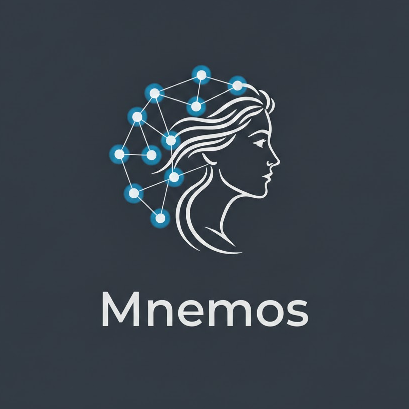

# Mnemos - Mini-LLM based on Transformers



## Introduction

**Mnemos** (comes from the [Greek deity of memory](https://en.wikipedia.org/wiki/Mnemosyne)) is a mini-LLM based on Transformers, designed for training and testing purposes. It is built to be lightweight and efficient, making it suitable for educational and experimental use.
This pedagogical project is built from scratch, so all the different components are available in this repository, and you don't need to install much additional dependencies.

- **Current Version of Mnemos Architecture**: 0.5.0 (POC)
- **Current Version of Mnemos Model**: 0.1.0

## Features

Mnemos includes the following user features:
- **Training on custom datasets**: You can load your own datasets and process them for training. Mnemos will automatically handle the tokenization and batching of the data, and adjust the model parameters accordingly.
- **Compatibility with CPU and GPU**: Mnemos is designed to run on both CPU and GPU (only CUDA-enabled GPUs), allowing you to choose the best option based on your hardware capabilities.
- **Testing with custom datasets**: You can test the model with your own datasets, allowing you to evaluate its performance on a separate validation set.
- **Generation of text**: Once trained, Mnemos can generate text based on the learned patterns from the training data. You can make your own prompts and see how the model responds.
- **Simple command-line interface**: Mnemos provides a straightforward command-line interface to interact with the model, making it easy to use for both training and inference.
- **Web interface**: A simple web interface is also available for easier interaction with the model or if you want to deploy it in a more user-friendly environment.
- **Mnemos API**: An API is provided to interact with the model, enabling integration with other applications or services.


## Installation

At first, clone the repository:
```bash
git clone https://github.com/Omikrone/Mnemos.git
cd Mnemos
```

### Docker

If you only want to test Mnemos without setting up a development environment, you can use the provided Docker image. This image includes all the necessary dependencies and allows you to run Mnemos in a containerized environment.

Before building the Docker image, you have to either train the model (see Training Instructions below) or download a pre-trained model (from the releases page). and place `model.pkl` and `vocab.json` files into the [`save` directory](/backend/model/mnemos/save/) (create it if it doesn't exist).

Then, you can build and run the Docker containers using Docker Compose:
```bash
docker compose up --build
```

### Custom Installation

On the other hand, if you want to train your own model or play with an existing one, you can set up a development environment by installing the required dependencies.

To install `mnemos-cli` and `mnemos` package, you can use the following command:
```bash
pip3 install -e backend/model
```

**Note**: 
- It is recommended to use a virtual environment to avoid conflicts with other Python packages.
- It is also recommended to install the mnemos package in editable mode (`-e` flag) to allow for easy development and testing.

### Backend Installation

To set up the backend server, navigate to the `backend/` directory and install the required dependencies:
```bash
cd backend/
pip3 install -r requirements.txt
```

### Frontend Installation

To set up the frontend web interface, navigate to the `frontend/` directory and install the required dependencies using npm or yarn:
```bash
cd frontend/
npm install
```

## Mnemos CLI

Mnemos is designed to be user-friendly and straightforward. It provides a simple command-line interface to interact with the model. You can choose to train, test, or generate text by running the main script.

After installing the `mnemos-cli` package, you can run the following command to start the CLI:
```bash
mnemos-cli
```

### Training Instructions

To train the model, follow these steps:
1. Prepare your dataset in a text file format and rename it to `train.txt`. The size of the training dataset should be between 20 MB and 100 MB for effective training (depending on your hardware capabilities).
2. Place the `train.txt` file in the `data/training/` directory in the [model directory](/backend/model/mnemos/) of the project (create this directory if it doesn't exist).
3. You can optionally adjust the hyperparameters in the [`config.py` file](/backend/model/mnemos/config/params.py) to suit your training needs. If you are unsure, see the recommended parameters in [MODEL.md](MODEL.md).
4. Choose the training option in the main menu.

### Testing Instructions

If you want to test the model, follow these steps:
1. Prepare your dataset in a text file format and rename it to `test.txt`.
2. Place the `test.txt` file in the `data/testing/` directory in the [model directory](/backend/model/mnemos/) of the project (create this directory if it doesn't exist).
3. Choose the testing option in the main menu.

### Inference Instructions

Once the model is trained, you can use it for inference (text generation) by choosing the inference option in the main menu and providing a prompt.

**Note**: if you trained your model with CuPy (GPU), you have to first migrate it to NumPy (CPU) before using it for inference on CPU. You can do this by running the following command:
```bash
python3 backend/model/mnemos/utils/migrate_model.py --input-path backend/model/mnemos/save/model.pkl --output-path backend/model/mnemos/save/model_numpy.pkl
```
Then, rename the migrated model file to `model.pkl` to use it for inference.

## Web Interface

To run the web interface, follow these steps:

1. Ensure that you have a trained model and that you have installed the `mnemos` package as described in the Installation section.

2. Start the backend server by navigating to the `backend/` directory and running:
```bash
uvicorn app.main:app --reload
```

3. Start the frontend development server by navigating to the `frontend/` directory and running:
```bash
npm run dev
```

## Common Issues

If you encounter some issues while training a Mnemos model, it may be due to bad hyperparameters or bad training data. During training, make sure to monitor the training and validation loss to ensure that the model is learning effectively. For example, if the training loss is decreasing but the validation loss is increasing, it may indicate overfitting. To avoid that, you can try to reproduce the training parameters used for traing ``Mnemos v0.1.0`` (see [MODEL.md](MODEL.md) for more details).

## Roadmap

The following features are planned for future versions of Mnemos:
- Support for Parquet and CSV datasets.
- Improve the Mnemos Architecture by adding an optimizer.
- Better user interface and improve installation process.